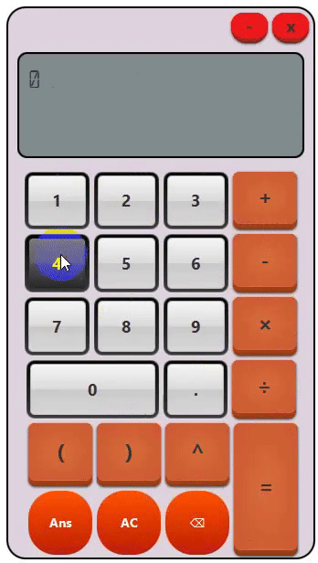

# Simple Calculator(JFX)

## How it looks like


## Abstract
> You can calculate
> Call ```LCDAnimation.h``` and call its function for animation.

## How to test
- Open command or terminal.
- Type ```git clone https://github.com/AyeChanAungThwin/SimpleCalculatorUsingJFX``` and press enter.
- Locate the project using STS or Eclipse IDE and then go to `File>Open Projects from File System` and then select the directory to load the project.
- Locate `App.java` and run it to test it.

## About
- [X] String manipulation
- [X] Inorder/Preorder Binary Trees
- [X] Builder Design Pattern
- [X] Stack

## Electronics Engineer-cum-J2EE Backend Developer ##
-  Created by - Aye Chan Aung Thwin